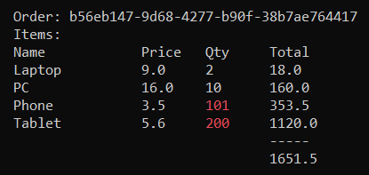

# SOLID-Principles

Simple examples of using the SOLID (or SDOLI) Principles in C# (.NET Core)

## References

**Chapter 8 of the book "Clean Architecture" by Robert C. Martin**

> A THOUGHT EXPERIMENT
> 
> Imagine, for a moment, that we have a system that displays a financial summary on a web page. The data on the page is scrollable, and negative numbers are rendered in red.
> 
> Now imagine that the stakeholders ask that this same information be produced into a report to be printed on a black-and-white printer. The report should be properly paginated, with appropriate page headers, page footers, and column labels. Negative numbers should be surrounded by parentheses.
> 
> Clearly there will be some new code to write. But how much old code will have to change?
> 
> A good software architecture would reduce the amount of changed code to the barest minimum. Ideally, zero.
> 
> How? By properly separating the things that change for different reasons (The SRP), and then organizing the dependencies between those things properly (The DIP).

**SDOLI**: from https://www.hanselman.com/blog/HanselminutesPodcast145SOLIDPrinciplesWithUncleBobRobertCMartin.aspx)

## Explanation

One does not adhere to each individual principle in isolation.

If you follow one principle, you will inadvertently follow the other principles.

If you follow OCP, you also have to follow SRP, and DIP

**Requirement:** Display order id with items. If quantity is greater than 100, render it in red.

### 1.0 SRP-violation

### 1.1 SRP

### 2. DIP

### 3. OCP

### 4.0 LSP-violation

